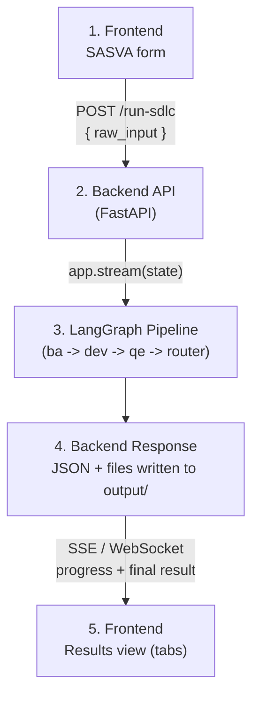
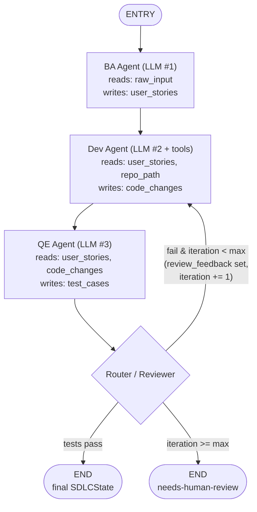
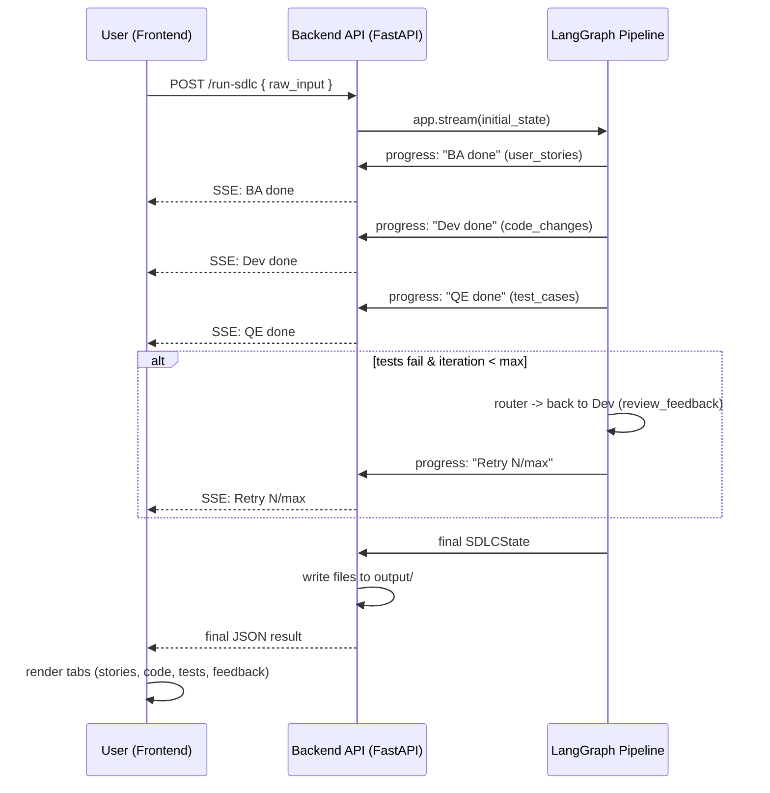

# Multi-Agent SDLC Pipeline with LangGraph

## Goal
Build a system where:
1. A frontend takes requirements input (SASVA-style) and produces **user stories**.
2. A **Dev Agent** generates code from those stories (greenfield and brownfield).
3. A **QE Agent** generates test cases from the stories + code.
4. Everything is orchestrated as a **LangGraph** workflow.

---

## End-to-End Target Workflow (Frontend → Output)

```
+----------------------------------------------------------------------------+
| 1. FRONTEND (Streamlit / React form)                                       |
|                                                                              |
|   User fills SASVA-style input fields:                                     |
|     - Scope / Situation                                                     |
|     - Actors                                                                |
|     - Steps / Scenario                                                      |
|     - Value / Outcome                                                       |
|     - Assumptions / Constraints                                             |
|                                                                              |
|   [ Submit ] --> POST /run-sdlc { raw_input: "<combined SASVA text>" }      |
+----------------------------------------------+-----------------------------+
                                                  |
                                                  v
+----------------------------------------------------------------------------+
| 2. BACKEND API (FastAPI)                                                    |
|                                                                              |
|   /run-sdlc endpoint receives raw_input, builds initial state:             |
|     SDLCState = {                                                           |
|       raw_input: "...",                                                     |
|       user_stories: [],                                                     |
|       code_changes: {},                                                     |
|       test_cases: [],          (Phase 2)                                   |
|       repo_path: None | "...", (brownfield, Phase 3)                       |
|       review_feedback: None,   (Phase 4 loop)                              |
|       iteration: 0                                                          |
|     }                                                                        |
|                                                                              |
|   for chunk in app.stream(state):   <-- streaming, not just invoke          |
|       yield progress to frontend (SSE/WebSocket)                           |
+----------------------------------------------+-----------------------------+
                                                  |
                                                  v
+----------------------------------------------------------------------------+
| 3. LANGGRAPH PIPELINE (graph/orchestration.py)                              |
|                                                                              |
|   ENTRY                                                                     |
|     |                                                                       |
|     v                                                                       |
|  +------------+  reads: raw_input                                          |
|  |  BA Agent   |  writes: user_stories                                     |
|  |  (LLM #1)   |  --> emits "BA done" progress event                       |
|  +-----+------+                                                            |
|        |                                                                   |
|        v                                                                   |
|  +------------+  reads: user_stories, repo_path (if brownfield)           |
|  | Dev Agent   |  writes: code_changes                                     |
|  |  (LLM #2    |  tools: read_file, grep_repo, write_file (brownfield)     |
|  |  + tools)   |  --> emits "Dev done" progress event                      |
|  +-----+------+                                                            |
|        |                                                                   |
|        v                                                                   |
|  +------------+  reads: user_stories, code_changes                        |
|  |  QE Agent   |  writes: test_cases (+ optional test run results)        |
|  |  (LLM #3)   |  --> emits "QE done" progress event                       |
|  +-----+------+                                                            |
|        |                                                                   |
|        v                                                                   |
|  +------------+  conditional_edge:                                        |
|  |  Router /   |    tests pass?  --> END                                   |
|  |  Reviewer   |    tests fail & iteration < max? --> back to Dev Agent    |
|  |             |      (with review_feedback)                               |
|  +-----+------+    iteration >= max? --> END (flag as needs-human-review) |
|        |                                                                   |
|        v                                                                   |
|       END --> final SDLCState                                              |
+----------------------------------------------+-----------------------------+
                                                  |
                                                  v
+----------------------------------------------------------------------------+
| 4. BACKEND RESPONSE                                                         |
|                                                                              |
|   Final state serialized to JSON:                                          |
|     { user_stories, code_changes, test_cases, review_feedback }            |
|   Code files also written to output/ (or target repo for brownfield)       |
+----------------------------------------------+-----------------------------+
                                                  |
                                                  v
+----------------------------------------------------------------------------+
| 5. FRONTEND (results view)                                                  |
|                                                                              |
|   Tabs:                                                                     |
|     - User Stories (cards: title, description, acceptance criteria)        |
|     - Generated Code (file tree + syntax-highlighted viewer)               |
|     - Test Cases (list, pass/fail status if executed)                      |
|     - Review Feedback (if loop triggered, show what was retried/why)       |
|                                                                              |
|   [ Download as ZIP ] [ Push to repo branch ] (future)                     |
+----------------------------------------------------------------------------+
```

---

## Mermaid Diagrams

### High-level end-to-end flow



### LangGraph pipeline detail (with Phase 4 retry loop)



> Phase 1 scope is just `Start -> BA -> Dev -> END` (no QE, no router, no loop).
> Phase 2 adds the QE node. Phase 4 adds the Router and the retry edge back to Dev.

### Sequence view (request lifecycle, Phase 4)



---

## 1. Core LangGraph concepts used

| Concept | Role in this system |
|---|---|
| **State** (TypedDict/Pydantic) | Shared object passed between agents — `raw_input`, `user_stories`, `code_changes`, `test_cases`, `repo_path`, `review_feedback`, `iteration` |
| **Node** | A function (often calling an LLM) that reads state, does work, returns updated state |
| **Edge** | Connects nodes — fixed (sequential) or conditional (`add_conditional_edges`) |
| **Graph** | Compiled `StateGraph` — the whole pipeline |
| **Checkpointer** | Persists state between runs — lets a human review/approve user stories before code-gen starts |

---

## 2. Shared state schema

```python
class SDLCState(TypedDict):
    raw_input: str               # from frontend (SASVA-style input)
    user_stories: list[dict]     # generated stories + acceptance criteria
    repo_path: str | None        # set for brownfield, None for greenfield
    code_changes: dict            # files -> generated/modified code
    test_cases: list[dict]
    review_feedback: str | None
    iteration: int
```

> Phase 1 only uses `raw_input`, `user_stories`, `code_changes`. The remaining fields
> (`repo_path`, `test_cases`, `review_feedback`, `iteration`) are reserved for Phases 2–4
> below and already exist in the schema so later phases don't need a breaking change.

---

## 3. Agent design (one node = one agent)

### Agent 1 — Requirements/BA Agent
- **Input**: raw requirements text from frontend
- **Output**: structured user stories (`As a... I want... so that...` + acceptance criteria), each with an ID
- Use a strict Pydantic output schema so downstream agents get structured data, not free text

### Agent 2 — Dev Agent
- **Greenfield**: take story -> generate file structure + code from scratch
- **Brownfield**:
  - First run a "repo context" sub-step — use a retrieval tool (read files, grep, or RAG over the codebase) to give the LLM relevant existing code
  - Then generate a diff/patch rather than full files
- Should have **tools**: file read/write, grep, run linter (ReAct-style tool-calling agent)

### Agent 3 — QE Agent
- **Input**: user stories + generated code
- **Output**: test cases (unit/integration), possibly actual test code (pytest/jest)
- Can optionally run tests and feed failures back

### Agent 4 — Orchestrator / Router
- Conditional edges: if tests fail -> loop back to Dev Agent with feedback (cap iterations to avoid infinite loops)
- If all pass -> end, output artifacts

---

## 4. Frontend
- Simplest: **Streamlit** (fastest for internal tools), or **FastAPI + React** for production-grade
- Form fields per SASVA input -> POST to `/run-sdlc` endpoint
- Backend triggers `graph.invoke(initial_state)` or `graph.stream(...)` for live, node-by-node progress (e.g. "BA Agent done -> Dev Agent running...")

---

## 5. Project structure

```
sdlc-agent/                          ← repo root
│
├── .gitignore                       ← root-level ignore (venv, .env, output, IDE)
├── LICENSE                          ← MIT
├── README.md                        ← quick-start, env vars, phase table
│
├── docs/                            ← architecture documentation
│   ├── 04_sdlc_multi_agent_architecture.md
│   └── multi-agent-coding-system-architecture.md
│
├── backend/                         ← FastAPI + LangGraph (Python)
│   ├── .env                         ← AZURE_OPENAI_* vars (gitignored)
│   ├── .env.example                 ← var name template
│   ├── .gitignore
│   ├── requirements.txt
│   │
│   ├── config/                      ← centralised settings
│   │   ├── __init__.py
│   │   └── settings.py              ← Settings class + get_settings() singleton
│   │
│   ├── main.py                      ← Phase 1: CLI entrypoint (invoke)
│   ├── app.py                       ← Phase 4: FastAPI entrypoint (uvicorn)
│   │
│   ├── api/                         ← Phase 4: HTTP layer
│   │   ├── __init__.py
│   │   └── routes/
│   │       ├── __init__.py
│   │       └── sdlc.py              ← POST /run-sdlc, SSE streaming
│   │
│   ├── graph/
│   │   ├── __init__.py
│   │   ├── llm.py                   ← shared model factory (reads from config)
│   │   ├── state.py                 ← SDLCState TypedDict + Pydantic schemas
│   │   ├── orchestration.py         ← StateGraph wiring (ba → dev → END)
│   │   │
│   │   ├── agents/
│   │   │   ├── __init__.py
│   │   │   ├── ba_agent.py          ← Phase 1 ✅  raw_input → user_stories
│   │   │   ├── dev_agent.py         ← Phase 1 ✅  user_stories → code_changes
│   │   │   ├── qe_agent.py          ← Phase 2     user_stories + code → test_cases
│   │   │   └── router.py            ← Phase 4     conditional retry loop
│   │   │
│   │   └── tools/                   ← Phase 3: brownfield repo tools
│   │       ├── __init__.py
│   │       ├── file_tools.py        ← read_file, write_file, list_dir
│   │       └── repo_tools.py        ← grep_repo, apply_patch
│   │
│   ├── tests/                       ← pytest test suite
│   │   ├── __init__.py
│   │   ├── conftest.py              ← shared fixtures (sample_raw_input, sample_user_stories)
│   │   ├── test_orchestration.py    ← graph wiring + end-to-end invoke tests
│   │   ├── test_agents/
│   │   │   ├── __init__.py
│   │   │   ├── test_ba_agent.py
│   │   │   ├── test_dev_agent.py
│   │   │   └── test_qe_agent.py     ← skipped until Phase 2
│   │   └── test_api/
│   │       ├── __init__.py
│   │       └── test_sdlc.py         ← skipped until Phase 4
│   │
│   └── output/                      ← generated greenfield code (gitignored)
│       └── .gitkeep
│
└── frontend/                        ← React + Vite (Phase 4, not yet created)
    ├── src/
    │   ├── components/
    │   │   ├── InputForm.tsx        ← SASVA fields → POST /run-sdlc
    │   │   ├── ResultTabs.tsx       ← stories / code / tests / feedback tabs
    │   │   └── ProgressFeed.tsx     ← SSE live progress events
    │   ├── App.tsx
    │   └── main.tsx
    ├── package.json
    └── vite.config.ts
```

> **Phase mapping**: `backend/` is runnable from Phase 1 as a CLI (`python main.py`).
> `api/` and `frontend/` are stubs activated in Phase 4.
> Run tests at any phase with `cd backend && pytest tests/ -v`.

---

## 6. Phased Roadmap

Each phase is independently runnable/testable before moving to the next. The graph only
grows (new nodes/edges); the state schema is already future-proofed (section 2) so no
breaking changes are needed between phases.

### Phase 1 — BA + Dev Agents (Greenfield), CLI POC  ✅ current scope

**Scope**: Sequential `ba -> dev -> END` graph, run via `python main.py` with a hardcoded
sample `raw_input`. No frontend, no API, no QE, no loops.

**Component architecture**:
```
backend/
├── .env / .env.example        --> AZURE_OPENAI_* vars
├── config/
│   └── settings.py            --> Settings singleton (loaded once at startup)
│
├── graph/
│   ├── state.py               --> SDLCState (TypedDict), UserStory/CodeChanges (pydantic)
│   ├── llm.py                 --> get_model() reads from config.settings
│   │
│   ├── agents/
│   │   ├── ba_agent.py        --> LLM #1 (ChatOpenAI)
│   │   │     in : raw_input
│   │   │     out: user_stories (structured via with_structured_output)
│   │   │
│   │   └── dev_agent.py       --> LLM #2 (ChatOpenAI, same model)
│   │         in : user_stories
│   │         out: code_changes (structured: {path: content})
│   │
│   └── orchestration.py       --> StateGraph wiring: ba -> dev -> END
│
├── tests/                     --> pytest suite (mocked LLM calls)
│   ├── conftest.py
│   ├── test_orchestration.py
│   └── test_agents/
│       ├── test_ba_agent.py
│       └── test_dev_agent.py
│
├── main.py                    --> CLI: loads .env, runs app.invoke(), writes output/
└── output/                    --> generated greenfield code files (gitignored)
```

**Data flow**:
```
raw_input (str) --> [ba_agent] --> user_stories --> [dev_agent] --> code_changes --> output/*.py
```

**Design points**:
- Structured outputs (Pydantic via `with_structured_output`) at each LLM boundary — no
  fragile string/JSON parsing between agents.
- Stateless agent functions; LangGraph owns orchestration/state-merging.
- Dev Agent decides relative file paths itself; everything lands under a fixed
  `sdlc_agents/output/` folder.

---

### Phase 2 — QE Agent

**Scope**: Add a QE node after Dev: `ba -> dev -> qe -> END`. QE Agent reads
`user_stories` + `code_changes` and produces `test_cases` (and optionally generated
test file content, written to `output/` alongside the source files).

**Graph change**:
```
ENTRY -> [ba] -> [dev] -> [qe] -> END
```

**Agent 3 — QE Agent** (`graph/agents/qe_agent.py`):
- in: `user_stories`, `code_changes`
- out: `test_cases: list[dict]` (e.g. `{id, title, steps, expected_result}` and/or
  generated `pytest` file content merged into `code_changes`)
- Same `ChatOpenAI` + `with_structured_output` pattern as BA/Dev

**New state field used**: `test_cases` (already in schema from Phase 1).

**Optional addition**: a `tools/test_runner.py` that actually executes generated
pytest files against generated code, capturing pass/fail — sets up the data
`review_feedback` will use in Phase 4.

---

### Phase 3 — Brownfield Support for Dev Agent

**Scope**: Allow `repo_path` to be set (existing project). Dev Agent becomes a
ReAct-style tool-calling agent that reads the existing codebase before generating
changes, and outputs **diffs/patches** instead of full files when `repo_path` is set.

**Graph change**: structure stays `ba -> dev -> qe -> END`; the `dev` node internally
becomes a small tool-calling loop (sub-graph or LangChain agent executor) instead of a
single LLM call.

**New tools** (`graph/tools/`):
- `read_file(path)` — read existing file content
- `grep_repo(pattern)` — search codebase for relevant code/conventions
- `list_dir(path)` — explore repo structure
- `write_file(path, content)` / `apply_patch(path, diff)` — apply changes

**Dev Agent behavior by mode**:
| Mode | `repo_path` | Output | Tools used |
|---|---|---|---|
| Greenfield (Phase 1) | `None` | full file contents → `output/` | none |
| Brownfield (Phase 3) | set | diffs/patches → applied to `repo_path` (or staged in `output/`) | read_file, grep_repo, list_dir, write_file |

**Architecture addition**:
```
[Dev Agent] <--tool calls--> [read_file / grep_repo / list_dir / write_file]
     |                                  |
     v                                  v
 code_changes (diffs)          repo_path (existing codebase)
```

---

### Phase 4 — Reviewer/Router Loop + Frontend & API

**Scope**: Close the loop and expose the system end-to-end (this is the full diagram at
the top of this doc).

**4a. Router/Reviewer node**:
- Conditional edge after `qe`:
  - all tests pass → `END`
  - tests fail **and** `iteration < max_iterations` → route back to `dev` with
    `review_feedback` populated (what failed and why) → `iteration += 1`
  - `iteration >= max_iterations` → `END`, flagged as `needs-human-review`

**Graph change**:
```
ENTRY -> [ba] -> [dev] -> [qe] -> [router]
                    ^                |
                    |                | (fail, iteration < max)
                    +----------------+
                                     |
                                     | (pass, or iteration >= max)
                                     v
                                    END
```

**4b. Backend API** (`frontend/api` or top-level `api.py`, FastAPI):
- `POST /run-sdlc { raw_input }` → builds initial `SDLCState`
- Uses `app.stream(state)` (not `invoke`) so progress events (`BA done`, `Dev done`,
  `QE done`, `Retry N/max`, ...) can be pushed to the frontend via SSE/WebSocket
- Returns final state as JSON; writes code files to `output/` (or `repo_path` for
  brownfield)

**4c. Frontend** (Streamlit first, React later if needed):
- Input form: SASVA fields (Scope, Actors, Steps, Value, Assumptions) → combined into
  `raw_input`
- Results view tabs: User Stories / Generated Code (file tree + viewer) / Test Cases /
  Review Feedback (loop history)
- Optional: download generated output as ZIP

**New state fields used**: `review_feedback`, `iteration` (already in schema).

---

## 7. Build order summary (incremental, testable at each step)
1. ✅ Phase 1 — `SDLCState`, BA + Dev agents, sequential graph, CLI, greenfield only
2. Phase 2 — Add QE Agent, generate test cases (+ optional test execution)
3. Phase 3 — Add brownfield support to Dev Agent (repo-reading/writing tools)
4. Phase 4 — Add Router/Reviewer conditional loop, then build FastAPI + frontend

**Recommendation**: Phase 1 (sequential graph, greenfield only) is the working skeleton —
validate it end-to-end before adding QE, brownfield, looping, or UI complexity.
