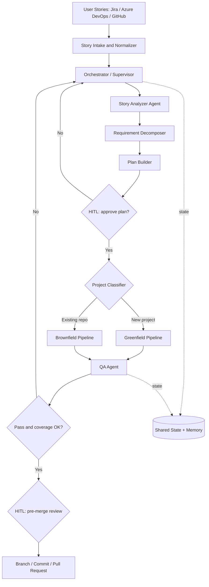
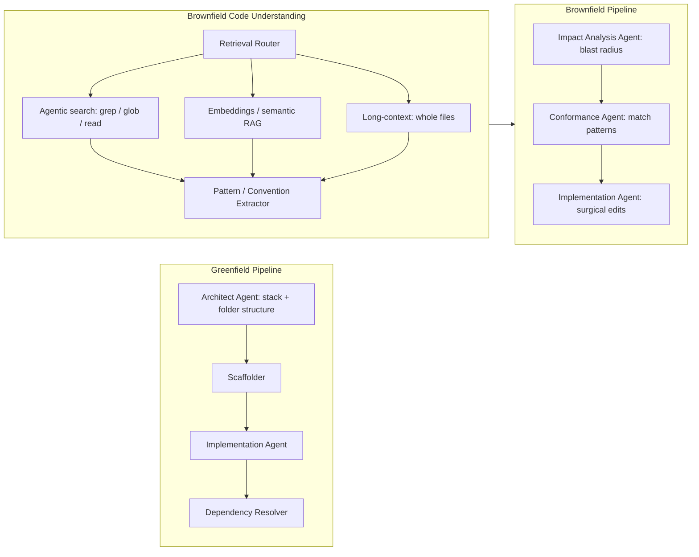
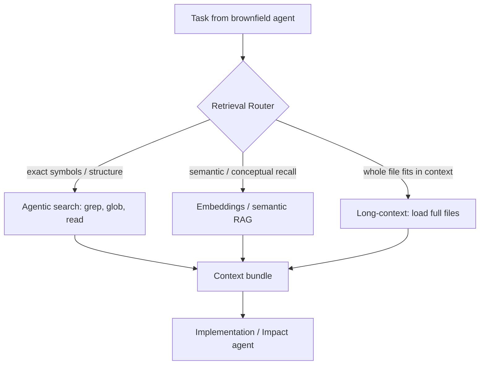
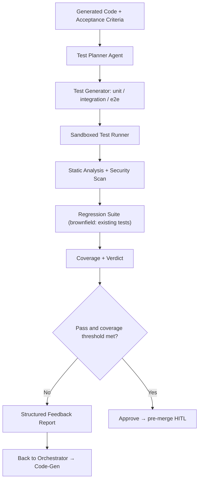
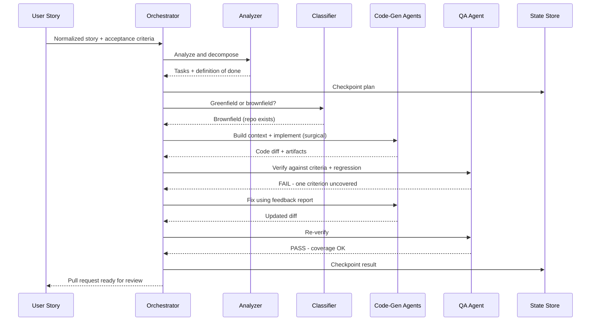

# Multi-Agent Coding System — Complete Architecture

**Use case:** A team of agents ingests user stories, analyzes them, generates code for **greenfield** (new) *and* **brownfield** (existing) codebases, then a **QA agent** tests the output and feeds failures back until the acceptance criteria are met.

> Note on diagrams: every Mermaid label below is quoted because characters like `&` and `:` are interpreted specially by Mermaid and silently break rendering. Quoting fixes it.

---

## Table of contents

1. Design goals & assumptions
2. End-to-end pipeline
3. Layer-by-layer breakdown
4. Greenfield vs brownfield code generation
5. Brownfield code understanding — three retrieval strategies (agentic search, embeddings/RAG, long-context) + when to pick each
6. QA agent
7. One story, end to end (sequence)
8. State, memory & observability
9. Suggested tech stack
10. Project structure
11. Decisions to make next

---

## 1. Design goals & assumptions

- A **supervisor/orchestrator** drives a stateful graph; specialist agents are nodes (LangGraph `StateGraph` or Microsoft Agent Framework — both fit your stack).
- Every step is **checkpointed** so a run is resumable and auditable.
- The **same QA gate** serves both pipelines; only the code-generation path differs.
- **Acceptance criteria are the contract** — they drive both code generation and the QA verdict.
- **Human-in-the-loop (HITL)** gates sit at plan approval and pre-merge.
- Stories arrive from Jira / Azure DevOps / GitHub Issues; repo access is via Git + MCP tools.

---

## 2. End-to-end pipeline



The orchestrator owns the loop. Failing QA does **not** retry blindly — it returns a structured feedback report to the orchestrator, which routes back to the relevant code-gen agent (capped at *N* iterations before escalating to a human).

---

## 3. Layer-by-layer breakdown

**Intake Layer.** Source connectors pull stories and normalize them into a canonical schema: `title`, `description`, `acceptance_criteria[]`, `non_functional_reqs[]`, `repo_ref` (null ⇒ likely greenfield), `labels`, `dependencies`.

**Orchestration Layer.** The supervisor agent maintains run state, decides the next node, enforces iteration caps, and triggers HITL gates. State (task graph, artifacts, decisions, test results) is persisted to Cosmos DB / Redis for resumability.

**Analysis Agents.**
- *Story Analyzer* — extracts functional requirements, acceptance criteria, NFRs (performance, security), and flags ambiguities.
- *Requirement Decomposer* — breaks the story into atomic, independently-testable dev tasks with explicit dependencies.
- *Plan Builder* — produces an ordered execution plan and a definition-of-done derived from acceptance criteria.
- *Project Classifier* — decides greenfield vs brownfield using `repo_ref`, repo size, and whether the target modules already exist.

**Code-Generation Layer.** Diverges by classification (section 4).

**QA Layer.** Shared verification gate (section 6).

**Tooling / Execution Layer.** Sandboxed containers for running code and tests, Git operations (branch/commit/PR), CI/CD hooks, and MCP tool servers (filesystem, Git, package registries).

**State, Memory & Observability.** Short-term working memory per task; long-term vector memory of past decisions; full tracing, token/cost accounting, and an eval harness.

---

## 4. Greenfield vs brownfield code generation

The split matters because brownfield must *understand and respect an existing codebase first*, while greenfield gets to establish conventions from scratch.



| Concern | Greenfield | Brownfield |
|---|---|---|
| Prerequisite step | None — start clean | **Build code-understanding context first** — agentic search, embeddings/RAG, or long-context (see §5) |
| Architecture | Architect agent chooses stack & structure | Inherit existing architecture; do not re-architect |
| Conventions | Establish & document new ones | Extract and conform to existing style/lint/patterns |
| Edit strategy | Generate whole modules from templates | Minimal, surgical diffs |
| Key risk | Over-engineering / wrong stack | **Regression** — breaking existing behavior |
| Extra agent | Scaffolder | Impact Analysis + Conformance |
| Test baseline | Build from acceptance criteria | Acceptance criteria **+ keep existing tests green** |

Whichever retrieval strategy you pick (§5), the goal is identical: feed every brownfield agent the repo's real APIs, naming, and conventions so generated code conforms to the codebase instead of hallucinating.

---

## 5. Brownfield code understanding — three retrieval strategies

The brownfield agent must find and respect existing code. As of 2026 the field has split into three live approaches, and they fail in different ways — so the right answer for an unattended pipeline is usually a **router** that picks per query, not a single strategy. The three:

1. **Agentic search** — no index; the agent explores on demand with grep/glob/read (Claude Code, Gemini CLI).
2. **Embeddings / semantic RAG** — precompute a vector index, retrieve semantically at query time (Cursor).
3. **Long-context** — load whole files into a very large context window and let the model attend over them (Antigravity / Gemini 3).



### 5.1 Agentic search (Claude Code style)

No index, no embeddings. The agent uses filesystem tools — grep for content, glob for file patterns, read for loading specific files — and explores the repo on demand, the way a human engineer follows a thread. Anthropic tried RAG with a local vector DB in early Claude Code and dropped it because agentic search outperformed it and avoided index staleness, security, and infra complexity.

- **Strengths:** always fresh (nothing to re-index), precise on exact symbol names, zero setup, no stored vectors to secure, and it improves "for free" as models get better.
- **Weaknesses:** burns more tokens on large repos, weaker on conceptual queries where you don't know the exact wording, and can wander before converging.
- **Pipeline fit:** excellent for precise, surgical edits and small-to-mid repos; watch worst-case token blow-up at scale.

### 5.2 Embeddings / semantic RAG (Cursor style)

Precompute an index: chunk the code, embed each chunk, store vectors in a DB, and retrieve semantically at query time. Cursor does exactly this — tree-sitter chunking, embeddings in Turbopuffer, Merkle-tree sync that re-indexes only changed files every few minutes.

This is the most involved strategy to build, so the rest of this subsection is how to do it *well*. It still earns its place when repos are too large to grep blindly and you need conceptual recall.

#### 5.2.1 Why naive chunking fails for code

Standard text RAG splits documents into fixed-size token windows or recursive character chunks. Applied to source code this is destructive:

- A single function gets split across two chunks, so neither chunk is independently meaningful.
- Imports and class context get separated from the method that depends on them.
- Indentation-sensitive languages (Python) get mangled at arbitrary cut points.
- Retrieval returns syntactically incomplete fragments the model cannot reliably reason about or safely edit.

#### 5.2.2 AST chunking

Parse the source into a syntax tree, then chunk along **syntactic boundaries** — function, method, class, or module-level block. Every chunk is a complete, self-contained unit. Each chunk carries metadata:

- `file_path`, `language`
- `symbol_name` and `signature` (e.g. `def charge(amount: int)`)
- `start_line`, `end_line`
- `parent` (enclosing class/module)
- `imports` needed by the chunk

This metadata is what lets the agent locate, cite, and edit the exact right place in the repo.

#### 5.2.3 tree-sitter

tree-sitter is the parser that makes AST chunking practical at scale:

- **Multi-language.** Grammars exist for nearly every mainstream language (Python, JS/TS, Java, Go, C#, …), so one chunking pipeline handles polyglot repos.
- **Fast and incremental.** On a commit it re-parses only the changed regions, which keeps re-indexing cheap (see §5.2.6).
- **Uniform API.** You walk the tree and select node types — `function_definition`, `class_definition`, `method_declaration` — as chunk boundaries, the same way across languages.
- **Error-tolerant.** It still produces a usable tree for partially-broken or in-progress files.

Practical rules when walking the tree:

- **Oversized functions** that exceed the embedding model's context get split by logical inner blocks, with the function signature + imports prepended to each piece as a "header" so context isn't lost.
- **Tiny adjacent nodes** (one-line helpers, constants) are merged to avoid over-fragmentation.
- **Method chunks** get the class signature prepended so a retrieved method still carries its class context.

#### 5.2.4 Chunking strategy comparison

| Strategy | How it splits | Pros | Cons | Use when |
|---|---|---|---|---|
| Fixed-size / token window | Every N tokens | Trivial, uniform sizes | Cuts through functions; poor for code | Quick prototypes only |
| Recursive character | On separators (newlines, braces) | Better than fixed | Still structure-blind | Mixed text/code docs |
| Line-based sliding window | N lines with overlap | Preserves some locality | No semantic boundaries | Logs, configs |
| **AST / syntax-aware** | On function/class/method nodes | Complete, meaningful units; rich metadata | Needs a parser per language | **Production code RAG** |
| **Hybrid (AST + size cap + overlap)** | AST first, then size-cap big nodes with header overlap | Best of both; bounded chunk sizes | Slightly more complex | **Recommended default** |

#### 5.2.5 Why code embeddings matter — and how

Embeddings turn each chunk into a vector capturing its *meaning*, so the agent can retrieve by intent, not just keywords.

- **Semantic retrieval.** Task: "add retry logic to the payment client." Embeddings surface the actual `PaymentClient`, related HTTP utils, and any existing retry/backoff helpers — even when the task wording doesn't match the code's wording. This is what prevents the agent from inventing APIs that don't exist.
- **Use code-aware embedding models.** Models trained on code capture semantics ("this function validates input", "this is a retry wrapper") far better than generic text embeddings, which over-index on surface tokens.
- **Hybrid search beats either half alone.** Combine keyword/BM25 with vector similarity:
  - exact symbol names (`PaymentClient`, `charge_with_retry`) → keyword search wins;
  - behavioral intent ("where do we handle failed charges") → vector search wins.
  Run both, then **rerank** the merged set. This is exactly the hybrid pattern Azure AI Search supports.
- **Augment retrieval with the dependency graph.** After vector retrieval, expand to callers and callees of the matched symbols so the agent sees the **blast radius** before editing. This directly feeds the Impact Analysis agent and is the backbone of regression safety.
- **What to embed.** The chunk body, optionally with a short natural-language summary prepended ("summary-augmented" embedding), which measurably improves retrieval. Store the vector plus all the metadata from §5.2.2 so results are filterable (by path, language, recency, test-coverage flag).

#### 5.2.6 Incremental indexing

On each commit, tree-sitter re-parses only changed files; only the changed chunks are re-embedded and upserted into the vector store, and affected edges in the dependency graph are updated. The index stays fresh without a full rebuild — critical once a repo is large.

### 5.3 Long-context (Antigravity / Gemini style)

Skip retrieval engineering: load whole relevant files — or an entire module/docs folder — into a very large context window (Gemini 3's ~1M tokens) and let the model attend over them. Antigravity leans on this, paired with on-demand file reads and a persistent "brain" of distilled notes and plans rather than chunk embeddings.

- **Strengths:** the model "sees everything" and reasons across files better; no chunking artifacts; no index to build or keep fresh.
- **Weaknesses:** cost scales with tokens; performance can degrade on content buried mid-prompt ("lost in the middle"); doesn't scale past what fits in the window.
- **Pipeline fit:** great when the relevant slice fits — one service, a feature folder, the docs. Pair it with agentic search to first narrow down *which* files to load.

### 5.4 When to pick each

| Signal | Best strategy |
|---|---|
| You know the exact symbol / string to find | Agentic search (grep) |
| Conceptual query, unsure of wording, huge repo | Embeddings / semantic RAG |
| Relevant slice fits in the context window | Long-context |
| Repo changes constantly; staleness is costly | Agentic search (always fresh) |
| Strict data isolation — no vectors off the machine | Agentic search or local long-context |
| Cross-file reasoning over a bounded module | Long-context |
| Hard cost ceiling per run at scale | Embeddings (bounded retrieval) |

### 5.5 Recommended default for this pipeline: hybrid + router

For an unattended multi-agent pipeline over enterprise brownfield repos, route per query rather than committing to one strategy:

- **Agentic grep/glob first** for exact symbols, call sites, and structure — cheap and precise.
- **Embeddings for semantic recall** when the agent doesn't know where the relevant code lives in a large repo.
- **Long-context to load whole files** once the candidate set is narrowed and fits the window.
- **Dependency graph on top** of whichever path found the seed symbols, to expand to callers/callees and compute blast radius — this feeds the Impact Analysis agent and is the backbone of regression safety.

This keeps token cost bounded, retrieval fresh, and still gives the model complete files to reason over when it matters. Practical sequencing: start **agentic-first** (simplest, lowest infra), and add the embeddings index only when repo size or conceptual-recall misses justify the extra machinery.

---

## 6. QA agent



The QA agent derives test cases directly from acceptance criteria, generates the tests, runs everything in a sandbox, and produces a **machine-readable verdict** (failures, stack traces, coverage gaps, lint/security findings). For brownfield it additionally runs the **existing test suite** to catch regressions. On failure it returns a targeted report — not just "tests failed" — so the code-gen agent can fix precisely.

---

## 7. One story, end to end



---

## 8. State, memory & observability

- **Short-term working memory** — per-task scratchpad held in the run state.
- **Long-term memory** — vector store of past decisions, architecture choices, and resolved bugs for reuse across stories.
- **Checkpointing** — every node writes to Cosmos DB / Redis so a run resumes after a crash or a human pause.
- **Observability** — tracing of every agent step, token/cost accounting per run, and an eval harness scoring plan quality, code correctness, and test coverage over time.

---

## 9. Suggested tech stack (mapped to your environment)

- **Orchestration:** LangGraph `StateGraph` or Microsoft Agent Framework (supervisor / group-chat pattern).
- **State & checkpointing:** Cosmos DB (durable) + Redis (hot working memory).
- **Brownfield retrieval (router):** agentic search (grep/glob/read) as the default; tree-sitter + code-aware embeddings + Azure AI Search (hybrid keyword + vector, with reranking) for semantic recall on large repos; long-context file loading when the slice fits. Dependency graph layered on top for blast-radius expansion.
- **Execution:** ephemeral, sandboxed containers — never run generated code on the host.
- **Tools:** MCP servers for filesystem, Git, and package registries.
- **Models:** a strong reasoning model for planning/architecture; a fast model for routine generation and test scaffolding.
- **Observability:** LangSmith or Azure AI Foundry evaluations + token/cost tracking.

---

## 10. Project structure

```
sdlc-agent/                          ← repo root
│
├── backend/                         ← FastAPI + LangGraph (Python)
│   ├── .env                         ← AZURE_OPENAI_* vars (gitignored)
│   ├── .env.example                 ← var name template
│   ├── .gitignore
│   ├── requirements.txt
│   │
│   ├── main.py                      ← Phase 1: CLI entrypoint (invoke)
│   ├── app.py                       ← Phase 4: FastAPI entrypoint (uvicorn)
│   │
│   ├── api/                         ← Phase 4: HTTP layer
│   │   ├── __init__.py
│   │   └── routes/
│   │       ├── __init__.py
│   │       └── sdlc.py              ← POST /run-sdlc, SSE streaming
│   │
│   ├── graph/
│   │   ├── __init__.py
│   │   ├── llm.py                   ← shared model (reads from .env)
│   │   ├── state.py                 ← SDLCState TypedDict + Pydantic schemas
│   │   ├── pipeline.py              ← StateGraph wiring
│   │   │
│   │   ├── agents/
│   │   │   ├── __init__.py
│   │   │   ├── ba_agent.py          ← Phase 1: raw_input → user_stories
│   │   │   ├── dev_agent.py         ← Phase 1: user_stories → code_changes
│   │   │   ├── qe_agent.py          ← Phase 2: user_stories + code → test_cases
│   │   │   └── router.py            ← Phase 4: conditional retry loop
│   │   │
│   │   └── tools/                   ← Phase 3: brownfield repo tools
│   │       ├── __init__.py
│   │       ├── file_tools.py        ← read_file, write_file, list_dir
│   │       └── repo_tools.py        ← grep_repo, apply_patch
│   │
│   └── output/                      ← generated greenfield code files
│
├── frontend/                        ← React + Vite (Phase 4)
│   ├── public/
│   ├── src/
│   │   ├── components/
│   │   │   ├── InputForm.tsx        ← SASVA fields → POST /run-sdlc
│   │   │   ├── ResultTabs.tsx       ← stories / code / tests / feedback tabs
│   │   │   └── ProgressFeed.tsx     ← SSE live progress events
│   │   ├── App.tsx
│   │   └── main.tsx
│   ├── package.json
│   └── vite.config.ts
│
└── README.md
```

| Layer | Maps to section | Phase |
|---|---|---|
| `backend/graph/agents/` | §3 Analysis + Code-Gen agents | 1–4 |
| `backend/graph/tools/` | §3 Tooling layer (agentic search, file I/O) | 3 |
| `backend/api/` | §2 Orchestration layer (HTTP + SSE) | 4 |
| `frontend/` | §2 end-to-end pipeline (SASVA form + results) | 4 |

---

## 11. Decisions to make next

- Iteration cap on the QA ↔ code-gen loop before human escalation (start at 3).
- Coverage threshold, and which findings are blocking vs advisory.
- Whether greenfield architecture choices need an HITL gate (recommended for the first release).
- Default brownfield retrieval strategy — agentic-first, or stand up an embeddings index from day one? (Start agentic; add embeddings when repo size or recall misses justify it — see §5.5.)
- Chunk size cap and overlap for oversized functions, *if* you build the embeddings path.
- Incremental re-indexing trigger (per commit vs per PR) for the embeddings index.
